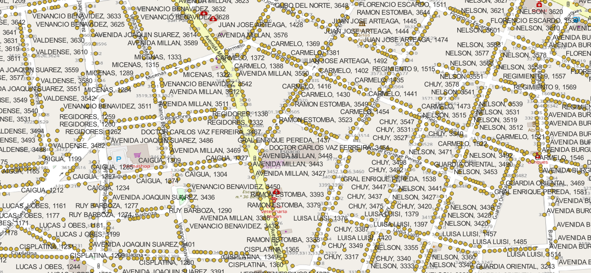

<aside>
<table align="right" style="padding: 1em">
<tr><td>Paquete <big><b>pk0002.01</b></big> de <small><a target="_afacodes" title="Jurisdicción" href="https://afa.codes/UY">UY</a></small>
</td></tr>
<tr><td>
Donante: <a rel="external" target="_doador" href="https://catalogodatos.gub.uy/dataset/ide-direcciones-geograficas-del-uruguay">Administración Nacional de Correos</a>
 &nbsp; <small>RUT 214130990011</small> • Wikidata <a rel="external" target="_doador" title="Enlace del descriptor Wikidata del donante" href="https://www.wikidata.org/wiki/Q5172888">Q5172888</a></small> 
Licencia <a rel="external" target="_doador" href="http://www.opendefinition.org/licenses/odc-odbl"><b>ODbL-1.0</b></a> (odbl<a title="SHA256 http://web.archive.org/web/20220418172356/https://opendatacommons.org/licenses/odbl/" href="http://web.archive.org/web/20220418172356/https://opendatacommons.org/licenses/odbl/"><code>webarchive</code></a>) 
Obtido via <i>site</i> em <b>18/03/2022</b> por:
 &nbsp; Avaliação técnica: <a rel="external" target="_gitPerson" title="Usuario de Git" href="https://github.com/luisfelipebr">luisfelipebr</a>
 &nbsp; Representação institucional: <a rel="external" target="_gitPerson" title="Usuario de" href="https://github.com/ThierryAJean">ThierryAJean</a> 
</td></tr>
<tr><td>Camadas:  </td></tr>
<tr><td>Datos publicados en <a href="https://git.digital-guard.org/preservCutGeo-UY2021/tree/main/data/_pk0002.01">preservCutGeo-UY2021</a> <a href="#reproducibilidad">Reproducible</a></td></tr>
<tr><td>Visualización:  </td></tr>
</table>
</aside>

<section>

Este repositorio de metadatos describe un paquete de archivos donados al dominio público. Está siendo conservado por Digital Guard: para obtener más detalles, consulte la [documentación sobre el proceso de registro y conservación](https://wiki.addressforall.org/doc/Documentação_Digital-guard).

Nota. Este documento README fue generado por software a partir de la información contenida en el archivo [`make_conf.yaml`](https://git.digital-guard.org/preserv-UY/blob/main/data/_pk0002.01/make_conf.yaml) en este paquete, e información adicional de los catálogos de [donantes](https://git.digital-guard.org/preserv-BR/blob/main/data/donor.csv) y [paquetes](https://git.digital-guard.org/preserv-BR/blob/main/data/donatedPack.csv).

# Capas de datos

Los archivos contienen "capas de datos" temáticas. Los metadatos también describen cómo se evaluó cada capa y cómo se filtraron sus datos de forma estandarizada.

##  geoaddress

Nombre del archivo: `uniao` *Descarga* e integridad: [2939e7ae1ee8801dd10619301ec034afb5c37d68b440a4d3f2b8416d30c1c13b.zip](http://dl.digital-guard.org/2939e7ae1ee8801dd10619301ec034afb5c37d68b440a4d3f2b8416d30c1c13b.zip) Descripción: arquivos.zip Tamaño del archivo: 38567969 bytes (36.78 <abbr title="mebibyte">MiB</abbr>) Formato: csv SRID: 4326

#### Datos relevantes
* `concat(num_puerta, ' ', letra_puerta)` (hnum)

* `nombre_via` (via)

* `localidad` (city_name)

* `codigo_postal` (postcode)

#### Otros datos relevantes
* `punto_wkb`
* `km`
* `manzana`
* `solar`
* `nombre_inmueble`
* `codigo_localidad`
* `departamento`

#### Filtrado de resultados y su publicación
51549815 bytes (49.16 <abbr title="mebibyte">MiB</abbr>) 958576 pontos densidad media: 900.55 pontos/km² GeoJSONs publicados em [https://git.digital-guard.org/preservCutGeo-UY2021/tree/main/data/_pk0002.01/geoaddress](https://git.digital-guard.org/preservCutGeo-UY2021/tree/main/data/_pk0002.01/geoaddress)

#### Visualización
[https://viz.addressforall.org/UY/_pk0002.01/geoaddress](https://viz.addressforall.org/UY/_pk0002.01/geoaddress)

# Evidencia de prueba

</section>
<section>

# Reproducibilidad

Consulte los detalles en [reproducibility.sh](https://git.digital-guard.org/preserv-UY/blob/main/data/_pk0002.01/reproducibility.sh).

</section>

