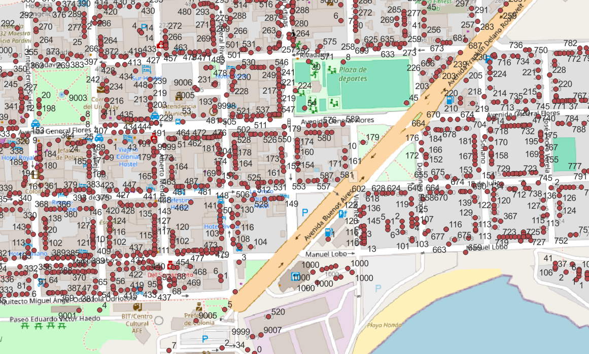

<aside>
<table align="right" style="padding: 1em">
<tr><td>Paquete <big><b>pk0002.02</b></big> de <small><a target="_afacodes" title="Jurisdicción" href="https://afa.codes/UY">UY</a></small>
</td></tr>
<tr><td>
Donante: <a rel="external" target="_doador" href="https://catalogodatos.gub.uy/dataset/ide-direcciones-geograficas-del-uruguay">Administración Nacional de Correos</a>
 &nbsp; <small>RUT 214130990011</small> • Wikidata <a rel="external" target="_doador" title="Enlace del descriptor Wikidata del donante" href="https://www.wikidata.org/wiki/Q5172888">Q5172888</a></small> 
Licencia <a rel="external" target="_doador" href="https://dl.digital-guard.org/21dd7133c71ad700cd55f6856189eb1f2e578e52291a52f6e350ee54dc72e80c.pdf"><b>Implied CC-BY</b></a> (by) 
Obtido via <i>e-mail</i> em <b>21/07/2024</b> por:
 &nbsp; Avaliação técnica: <a rel="external" target="_gitPerson" title="Usuario de Git" href="https://github.com/crebollobr">crebollobr</a>
 &nbsp; Representação institucional: <a rel="external" target="_gitPerson" title="Usuario de" href="https://github.com/ThierryAJean">ThierryAJean</a> 
</td></tr>
<tr><td>Camadas:   </td></tr>
<tr><td>Datos publicados en <a href="https://git.digital-guard.org/preservCutGeo-UY2021/tree/main/data/_pk0002.02">preservCutGeo-UY2021</a> <a href="#reproducibilidad">Reproducible</a></td></tr>
<tr><td>Visualización:   </td></tr>
</table>
</aside>

<section>

Este repositorio de metadatos describe un paquete de archivos donados al dominio público. Está siendo conservado por Digital Guard: para obtener más detalles, consulte la [documentación sobre el proceso de registro y conservación](https://wiki.addressforall.org/doc/Documentação_Digital-guard).

Nota. Este documento README fue generado por software a partir de la información contenida en el archivo [`make_conf.yaml`](https://git.digital-guard.org/preserv-UY/blob/main/data/_pk0002.02/make_conf.yaml) en este paquete, e información adicional de los catálogos de [donantes](https://git.digital-guard.org/preserv-BR/blob/main/data/donor.csv) y [paquetes](https://git.digital-guard.org/preserv-BR/blob/main/data/donatedPack.csv).

# Capas de datos

Los archivos contienen "capas de datos" temáticas. Los metadatos también describen cómo se evaluó cada capa y cómo se filtraron sus datos de forma estandarizada.

##  geoaddress

Nombre del archivo: `Direcciones UY/Direcciones` *Descarga* e integridad: [64daddb011e54b8ec3508088a961d3bbfa6e0671bd7435ca0dc77ecb5967614c.7z](https://dl.digital-guard.org/64daddb011e54b8ec3508088a961d3bbfa6e0671bd7435ca0dc77ecb5967614c.7z) Descripción: Arquivos Formato: shp SRID: 32721

#### Datos relevantes
* `numero` (hnum)

* `nombre` (via)

#### Otros datos relevantes
* `id`
* `idcalle`
* `cp`

#### Filtrado de resultados y su publicación
50364274 bytes (48.03 <abbr title="mebibyte">MiB</abbr>) 936540 pontos densidad media: 876.82 pontos/km² GeoJSONs publicados em [https://git.digital-guard.org/preservCutGeo-UY2021/tree/main/data/_pk0002.02/geoaddress](https://git.digital-guard.org/preservCutGeo-UY2021/tree/main/data/_pk0002.02/geoaddress)

#### Visualización
[https://viz.addressforall.org/UY/_pk0002.02/geoaddress](https://viz.addressforall.org/UY/_pk0002.02/geoaddress)
##  via

Nombre del archivo: `Direcciones UY/Ejes_calle` *Descarga* e integridad: [64daddb011e54b8ec3508088a961d3bbfa6e0671bd7435ca0dc77ecb5967614c.7z](https://dl.digital-guard.org/64daddb011e54b8ec3508088a961d3bbfa6e0671bd7435ca0dc77ecb5967614c.7z) Descripción: Arquivos Formato: shp SRID: 32721

#### Datos relevantes
* `nombre` (via)

#### Otros datos relevantes
* `idcalle`
* `tipo_viali`
* `tipo_via_1`

#### Filtrado de resultados y su publicación
32807232 bytes (31.29 <abbr title="mebibyte">MiB</abbr>) 54886 segmentos con 69152.32 <abbr title="quilômetros">km</abbr> densidad media: 1.03 segmentos/km² GeoJSONs publicados em [https://git.digital-guard.org/preservCutGeo-UY2021/tree/main/data/_pk0002.02/via](https://git.digital-guard.org/preservCutGeo-UY2021/tree/main/data/_pk0002.02/via)

#### Visualización
[https://viz.addressforall.org/UY/_pk0002.02/via](https://viz.addressforall.org/UY/_pk0002.02/via)

# Evidencia de prueba

</section>
<section>

# Reproducibilidad

Consulte los detalles en [reproducibility.sh](https://git.digital-guard.org/preserv-UY/blob/main/data/_pk0002.02/reproducibility.sh).

</section>

